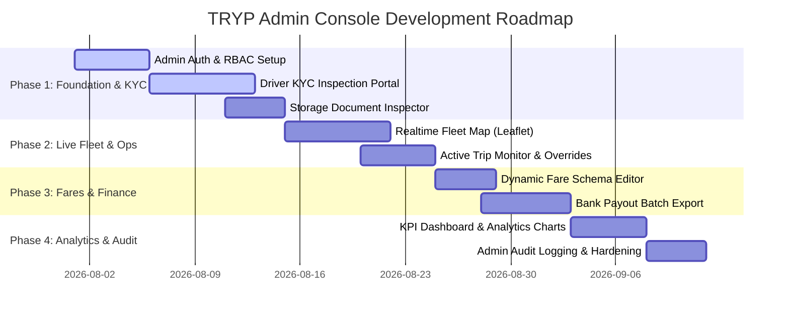

# TRYP Admin Console — Architectural & Implementation Plan

> **System Overview**: A high-performance, web-based Back-Office Operations & Fleet Management Portal designed for TRYP administrators, dispatchers, KYC compliance officers, and financial managers. Built to seamlessly integrate with the TRYP Supabase backend, realtime channels, and document storage.

---

## 1. Core Architecture & Tech Stack

```
                                  ┌────────────────────────┐
                                  │   TRYP Admin Portal    │
                                  │ (Next.js / Vite + React│
                                  │   + Tailwind + Lucide) │
                                  └───────────┬────────────┘
                                              │
                         ┌────────────────────┴────────────────────┐
                         │                                         │
             ┌───────────▼───────────┐                 ┌───────────▼───────────┐
             │ Supabase Auth (RBAC)  │                 │ Supabase Realtime WS  │
             │ admin / kyc / support │                 │ Rides & Driver Status │
             └───────────┬───────────┘                 └───────────┬───────────┘
                         │                                         │
       ┌─────────────────┼──────────────────┬──────────────────────┤
       │                 │                  │                      │
┌──────▼──────┐   ┌──────▼──────┐   ┌───────▼───────┐   ┌──────────▼──────────┐
│  profiles   │   │    rides    │   │  driver-docs  │   │    fare_schemas     │
│ PostgreSQL  │   │ PostgreSQL  │   │Storage Bucket │   │    PostgreSQL       │
└─────────────┘   └─────────────┘   └───────────────┘   └─────────────────────┘
```

### Technology Selection
* **Frontend Framework**: Next.js 14+ / React (TypeScript, App Router, Server Components).
* **UI Components & Styling**: TailwindCSS, Shadcn UI / Radix UI, Lucide Icons, Recharts (for Analytics).
* **Maps & Geolocation**: Leaflet / Google Maps JS SDK (for realtime vehicle fleet tracking).
* **Backend Connection**: `@supabase/supabase-js` v2.
* **State Management & Data Fetching**: TanStack Query (React Query) + Supabase Realtime subscriptions.

---

## 2. Role-Based Access Control (RBAC)

The Admin Console enforces strict access controls based on admin role claims stored in `public.profiles` (`role = 'admin'`) or Supabase app metadata (`admin_role`).

| Admin Role | Permissions & Scope | Primary Interface Modules |
| :--- | :--- | :--- |
| **Super Admin** | Full system control: modify admin accounts, adjust fare schemas, override financial balances, system config | All Modules |
| **KYC Compliance Officer** | Inspect driver uploaded verification documents, approve/reject driver profiles, issue document re-upload flags | Driver KYC Verification Portal |
| **Fleet Dispatcher** | Monitor live driver online locations, manage active rides, perform manual trip cancellations/reassignments | Live Fleet Command Center |
| **Financial / Support Agent** | Inspect earnings, manage payouts, resolve passenger refund requests, audit bank account details | User Directory, Payouts & Support |

---

## 3. Detailed Functional Modules Specification

### Module 1: Driver KYC & Verification Inspection Engine
*Designed for fast, secure driver onboarding and verification document compliance.*

```
+-----------------------------------------------------------------------------------+
|  [< Back to Queue]      Driver KYC Review: David Khumalo                          |
+------------------------------------+----------------------------------------------+
| Driver Information                 | Document Viewer (PrDP License)               |
| • ID Number: 8801015800081         | +------------------------------------------+ |
| • License No: DL982341-ZA          | |                                          | |
| • Vehicle: Toyota Corolla Quest    | |      [ High-Res Scan Image Preview ]     | |
| • Operating City: Johannesburg     | |      Source: driver-documents bucket    | |
| • Bank: FNB (Acct: 6281****3910)   | |                                          | |
|                                    | +------------------------------------------+ |
| Document Status Check:             | Zoom: [ - ] [ + ] | Rotate | Download      |
| [✓] PrDP License (Uploaded)        +----------------------------------------------+
| [✓] Vehicle Registration (RC)      | Verification Action Bar                      |
| [!] Insurance (Action Required)    | [ Approve Driver & Grant Badge ]            |
| [✓] Roadworthiness Certificate     | [ Flag Selected Doc for Re-upload ]           |
|                                    | [ Reject Application ]                       |
+------------------------------------+----------------------------------------------+
```

* **Data Sources**: `public.profiles` (`driver_status`, `doc_*`, `vehicle_*`, `bank_*`) + Supabase Storage Bucket `driver-documents`.
* **Key Features**:
  1. **Verification Queue**: Filterable list by `pending`, `under_review`, `approved`, and `rejected`.
  2. **Split-Screen Inspector**: Dual-panel view comparing driver data against high-res image previews fetched via `storage.from('driver-documents').getPublicUrl()`.
  3. **One-Click Approval**: Updates `profiles.driver_status = 'approved'` and sets document statuses (`doc_prdp_status = 'approved'`), immediately enabling the driver's verification tick badge and online toggle.
  4. **Targeted Flagging**: Select specific document(s) for re-upload with standard error tags (e.g., *"Blurry Scan"*, *"Expired License"*). Triggers an automated in-app push notification via `push_token`.

---

### Module 2: Realtime Fleet Command Center & Active Rides
*Live map visualization and trip lifecycle tracking using Supabase Realtime.*

```
+-----------------------------------------------------------------------------------+
|  TRYP Live Fleet Map                                Filters: [All Cities ▾] [Online] |
+-----------------------------------------------------------------------------------+
|  +-----------------------------------------------------------------------------+  |
|  |                                                                             |  |
|  |     [📍 Driver: K. Mokoena (Online)]                                         |  |
|  |            \                                                                |  |
|  |             \─── [🚘 Trip #8912 - In Progress] ───> [📍 Destination]       |  |
|  |                                                                             |  |
|  |      [📍 Driver: S. Zulu (Available)]                                        |  |
|  |                                                                             |  |
|  +-----------------------------------------------------------------------------+  |
|                                                                                   |
| Active Trips Table (Live Subscription: public.rides)                              |
| ID      | Passenger    | Driver       | Fare   | Status      | Actions            |
| #8912   | S. Dlamini   | K. Mokoena   | R82.50 | In Trip 🟢  | [Details] [Cancel] |
| #8913   | M. Naidoo    | Searching... | R45.00 | Requested   | [Assign Driver]    |
+-----------------------------------------------------------------------------------+
```

* **Data Sources**: `public.rides` (Realtime channel stream) + `public.profiles` (`is_online = true`).
* **Key Features**:
  1. **Interactive Fleet Map**: Live markers showing driver positions (`pickup_lat`, `pickup_lng`, `dest_lat`, `dest_lng`) and active trip routes.
  2. **Realtime WebSocket Stream**: Subscribes to Supabase `postgres_changes` for `rides` table updates:
     - `INSERT`: Alerts dispatcher of new incoming ride requests.
     - `UPDATE`: Dynamically updates status badges (`requested` ➔ `accepted` ➔ `arrived` ➔ `in_trip` ➔ `completed`).
  3. **Manual Overrides**: Emergency ride cancellation, fare adjustment, or manual driver assignment.

---

### Module 3: Dynamic Fare & Surge Pricing Engine
*Control platform economics, base rates, per-kilometer pricing, and minimum fares.*

* **Data Sources**: `public.fare_schemas` (`base_fare`, `per_km_rate`, `min_fare`, `currency_symbol`).
* **Key Features**:
  1. **Base Pricing Editor**: Adjust base fare, distance rates (R/km), and minimum fare threshold in real time without redeploying mobile apps.
  2. **Tier-Based Pricing**: Specific rate tables for **TRYP Go**, **TRYP Comfort**, **TRYP XL**, and **TRYP Exec**.
  3. **Surge Multiplier Rules**: Configure peak-hour multipliers (e.g. 1.2x - 2.0x) triggered by geographic demand density or weather conditions.

```sql
-- Dynamic Fare Pricing Schema Control Example
UPDATE public.fare_schemas
SET 
  base_fare = 18.00,
  per_km_rate = 6.00,
  min_fare = 25.00,
  updated_at = timezone('utc', now())
WHERE id = 'default';
```

---

### Module 4: Financial Operations, Earnings & Driver Payouts
*Streamlining driver payout calculations and Paystack transaction audits.*

* **Data Sources**: `public.profiles` (`bank_name`, `bank_account_number`, `bank_branch_code`, `bank_account_holder`, `wallet_balance`) + `public.rides` (`fare`, `payment_method`, `payment_status`, `payment_reference`).
* **Key Features**:
  1. **Daily Settlement Dashboard**: Calculates total net earnings per driver after deducting platform commission.
  2. **Banking Information Audit**: Validates bank account holder names against driver profile identity for fraud prevention.
  3. **Automated Batch Payout Export**: Generates CSV / JSON / ISO20022 SEPA payment files ready for South African bank host-to-host payout upload (FNB, Capitec, Standard Bank, Absa, Nedbank).
  4. **Paystack Payment Reconciliation**: Cross-references `payment_reference` tokens with Paystack Webhook transactions.

---

### Module 5: Passenger & Driver User Management Directory
*Central user lookup, rating management, and safety controls.*

* **Data Sources**: `public.profiles` (`full_name`, `email`, `phone`, `role`, `rating`, `wallet_balance`, `emergency_contact_*`).
* **Key Features**:
  1. **Unified Search**: Search users by name, phone number, email, SA ID number, or vehicle plate.
  2. **Driver Profile View**: Complete history of completed trips, average passenger rating, vehicle specs, and uploaded document links.
  3. **Passenger Account Controls**: Manage wallet balances, view saved places (`public.saved_places`), and review emergency contact information.
  4. **Safety & Suspension**: Instant account suspension toggle (`driver_status = 'rejected'`) for safety violations.

---

## 4. Admin Database Schema Extensions

To support administrative actions and auditability, the following administrative tables should be added:

```sql
-- Migration: Admin Audit Logs & Admin Users
CREATE TABLE IF NOT EXISTS public.admin_audit_logs (
  id UUID PRIMARY KEY DEFAULT gen_random_uuid(),
  admin_id UUID NOT NULL REFERENCES public.profiles(id) ON DELETE CASCADE,
  action TEXT NOT NULL, -- e.g. 'APPROVE_DRIVER', 'REJECT_DOCUMENT', 'UPDATE_FARE_SCHEMA'
  target_id UUID,       -- Target profile_id, ride_id, or schema_id
  details JSONB,        -- Context payload (e.g. rejection reasons, previous vs new values)
  ip_address TEXT,
  created_at TIMESTAMPTZ DEFAULT timezone('utc', now()) NOT NULL
);

-- Index for auditing administrative actions
CREATE INDEX IF NOT EXISTS idx_admin_audit_logs_admin_id ON public.admin_audit_logs(admin_id);
CREATE INDEX IF NOT EXISTS idx_admin_audit_logs_action ON public.admin_audit_logs(action);
```

---

## 5. Phased Implementation Roadmap



### Phase 1: Core Foundation & Driver KYC Inspection Portal (Week 1–2)
* Setup Next.js 14 project structure, TailwindCSS styling, and Supabase client initialization.
* Implement Admin Login with role-based routing (`role = 'admin'`).
* Build **Driver KYC Review Screen**: Fetch queued drivers, render split-screen document viewer for `driver-documents` Storage bucket, and implement **Approve** / **Reject** / **Flag** actions.

### Phase 2: Realtime Fleet Command Center & Ride Operations (Week 2–3)
* Implement Leaflet / Google Maps JS tracking for online drivers (`is_online = true`).
* Subscribe to `public.rides` realtime websocket channel for status updates (`requested` -> `completed`).
* Build active trip detail drawer and manual dispatch/cancellation tools.

### Phase 3: Dynamic Fare Management & Financial Payouts (Week 3–4)
* Build **Fare Schema Management UI** to update `fare_schemas` rates dynamically.
* Build **Driver Payout Settlement Portal**: aggregate driver earnings, verify bank details, and export CSV/SEPA payout files.

### Phase 4: Analytics, User Directory & Audit Logging (Week 4)
* Implement high-level KPI dashboard (Total Completed Rides, Platform Revenue, Active Drivers, Pending KYC Count).
* Build full **Passenger & Driver User Directory** with wallet balance adjustment features.
* Deploy `admin_audit_logs` table and logging middleware to audit all admin operations.
